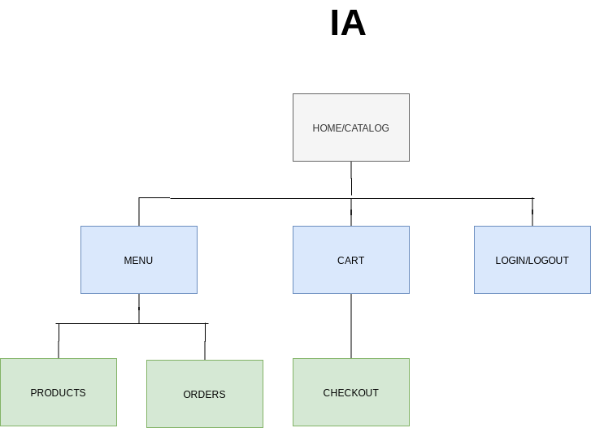
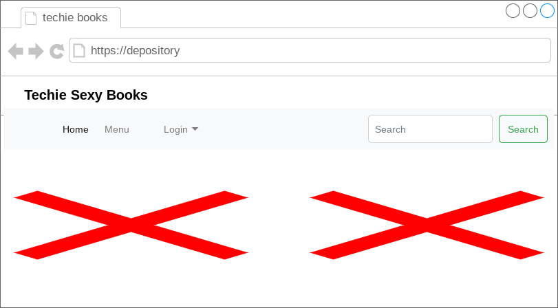
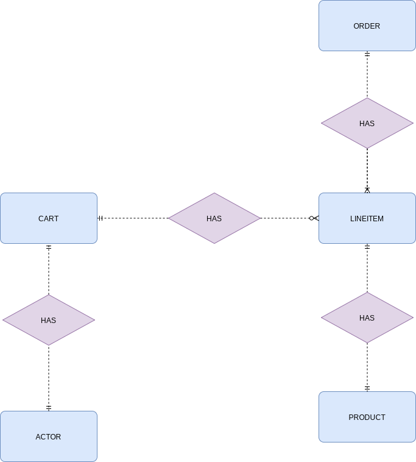

# Depository Initial Study

## Usecases

    - The buyer uses depository to browse for products the company has to
      sell, select some to purchase, and supply the information needed to
      create an order.

        - Example seller scenario : Jon a customer of depository wants to buy a book
          about docker technology to expand is knowledge on docker. So jon first
          browses depository's site for books on docker, then selects a docker
          book that meets is criteria, and then provides details to create
          his purchase order.

    - The seller uses depository to maintain a list of products to sell,
      to determine the orders that are awaiting shippment, and to mark orders
      as shipped.

        - Example seller scenario: Alice the owner of depository uses depository
          application to maintain a list of products, eg: technoloy books to sell,
          she also uses depository to keep track of her orders awaiting shippment,
          and mark orders as shipped.

## Discover Content, Purpose

    The content, and purpose of the website is to enable Jon to sell tech books
    to potential customers, and for customers to browse, and purchase tech books
    by placing a order.

## Brainstorm Theme

    - Book Tech
    - Book World
    - Tech skill
    - Horizon Books
    - Tech Books For U
    - Techie Sexy Books

## Brainstorm Visual Metaphors

    - Landing page has open book
    - Book as a background of theme title, potential logo
    - Nice looking female sillouette for the background for techie sexy books logo
    - Color lots of white and blue scattered throughout
    - Tech words repeated throughout site in contrast to white background
    - Binary digits
    - highlevel src code

## Information Architecture

## Mockup Landing Page

## Data Model

    
